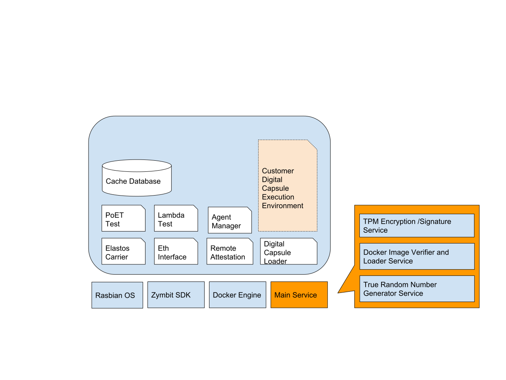

# April 8th goal
## Raspberry Pi TPM install and Dev env
Done

## Raspberry Pi TPM test code
Has errors, waiting for Zymbit customer serfices hlep

## PUF: Can we run DRAM PUF on a HPC?
University of Chicago professor: It is doable. 
Need to confirm with linux core developer (Sat Mar 16 meeting)

## Modules List

### Rasbian OS
At the PoC stage, we can use existing Rasbian OS to save some time. In the future, we should modify the OS, remove any libs we do not need to minimize the attack surface.

### Zymbit SDK
Install from Zymbit

### Docker Engine
Install from Docker for Raspberry Pi

### Main Services
This is the only services loaded from outside of docker. It runs direclty from the RPi instead of Docker container becuase it will directly intereact with Zymbit SDK. It is also the communication hub between each Docker containers.

#### True Random Number Generator
It just call the Zymbit TPM's TRNG to get the random number. 
we just assume that Zymbit TPM can provie a true random number in our PoC stage.

#### Docker Image Verifier and Loader Service
Other services are all running inside Docker Container. We need a loader to load them into docker after verify the hash. We do not want to load any compromised docker image. 
The this service will compare the hash against the hash value stored in blockchain. Do not load if not matching.
Because it load into Docker, so it has to be running outside of docker container.

#### TPM Encryption/ Signature service
It just call TPM's API. 

### Elastos Carrier
A modified version of Elastos Carrier. Additional logic when handshake with a new nodes. We will need 
- Proof of Trust from the new nodes. 
- Existing nodes need to check its historical data stored in blockchain (layer 1)
- Signature fits its public key (stored in blockchain)

The logic of determine connect or not is inside the "Remote Attestation" module. 

### Eth Interface
We put reward/panelty logic in smart contract of Eth sidechain.
This is the Web3 interface to the Eth side chain.

### Remote Attestation

The main consensus module. More detail in separated document

### Digital Capsule loader

### PoET test

### Lambda Test

### Agent Manager

### Cache Database

### Customer Digital Capsule Execution Environment

## Details Tasks List, Phase I goal

### Setup RPi with TPM
### P2P Carrier node in Docker Container
### Add logic into Carrier handshaking
At present, the Carrier will allow new node to join as long as it run the same protocol. 
We are going to add some placeholder logic to set a threshold. In the future we will replace the placeholder to the real logic to verify if the new node meet Trusted Computing requirement. 

the now the placeholder just read a state in local file. If exists it is approved. next step is to read the stat from Eth sidechain of Elastos. The last, replace with real remote attestation.

### Add Eth sidechain to Elastos for POC purpose
this Eth sidechain is a new sidechain running Eth EVM. The smart contract will be used to record the credit score of each involved nodes. Events will be triggered by the nodes, set remote attestation result, increase or decrease the credit score.

Data structure include
- Map of (public address, nodeRecord)
- nodeRecord is (creditScore, header_Pointing_to_a_chain_of_history)

Actions (entry point of smart contract triggered by nodes) include
- sign to agree/disagree another node to join the trusted P2P network
- remote attestation report to anther node
- 

Events includes
- 

### Communication between P2P node and Eth
We use web3.js as API between P2P nodes and Eth

### Every P2P node to cache latest Eth sidechain stat so that they can query internally
When new Eth block is mined, all P2P nodes get notified and load the latest block to update its internal database for latest stat.
When query current node credit, no need to Web3 other Eth nodes. they can use local light weight database to cache. (levelDB?)

### Main service

## System design document

## Team composition, JD for each team member

## Looking for POET implementation (sample code)

## ABC Blockchain Community pannel talk on Digital Capsule
Done, on Mar 14th.

## Research on Global Status. Do we, or can we work as a global status compatible blockchain (layer2)

working on
